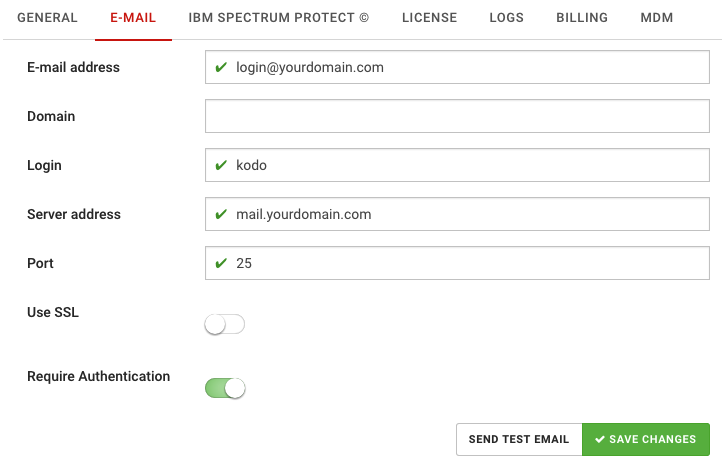
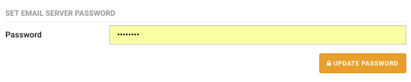

# E-mail server configuration

To set up e-mail server:

1. Click **Settings** located in top bar, this will move you to KODO configuration page
2. Click **General** tab.
3. Provide the necessary information for the e-mail server configuration
   * **E-mail address** – address used to sending e-mails from KODO
   * **Login** – username used to login to e-mail server \(optional\)
   * **Server address** - IP or DNS name of the e-mail server
   * **Port** - port of the e-mail server
   * **Use SSL** - set to "on" if SSL communication is required
   * **Require Authentication** - set to “on” if server requires authentication

     
4. Click **SAVE CHANGES** button.
5. Provide password for e-mail server in **SET EMAIL SERVER PASSWORD** section

   

6. click “UPDATE PASSWORD” button

_TIP: You can test your configuration click **SEND TEST EMAIL** button_

