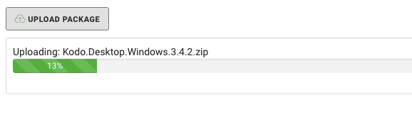

# KODO client deployment packages

To use KODO client you first need to upload KODO client packages.

To get access to KODO client packages please contat with [Storware Professional Services Team](mailto:ps@storware.eu) or one of our local [partners](https://storware.eu/en/partners/).

_TIP: If you are using KODO Server VA, client packages should be already available_

To upload client packages to your KODO Server follow the steps:

1. Click **Deployment** located in left menu, this will move you to KODO deployemnt page
2. Click **Upload package** button, select downloaded client package and click **Open**
3. Package will be uploaded, after sucessful installation information will be displayed

