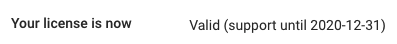

# License registration

After installation or Virtual Appliance deployment KODO Server is running in TRIAL mode for 30 days. After that time you need to provide vaild license key.

To get a license key please contact with our local [partner](https://storware.eu/en/partners/) or [Storware](mailto:info@storware.eu) team.

If you already have a valid license key please follow the steps:

1. Click **Settings** located in top bar, this will move you to KODO configuration page
2. Click **License** tab.
3. Provide your license key in **Update your Kodo license key** field
4. Click **UPDATE LICENSE** button

_TIP: You can check trail or license expiration date in **Your license is now** sextion_  

