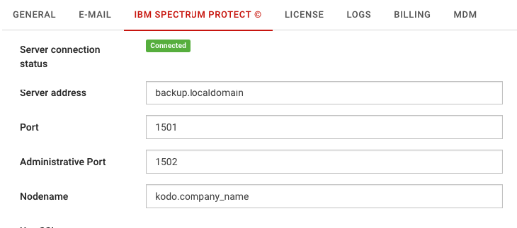
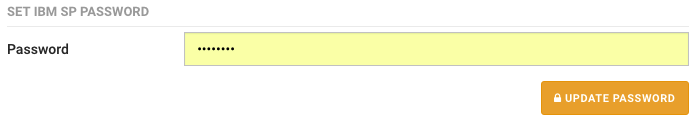

# Spectrum Protect \(TSM\) configuration

**NOTE: If you are using KODO Virtual Appliance change "Server address" configuration. "Server address" should point to KODO server IP address that will be available for backup clients! For Virtual Appliance no further changes are required.**

To set up connection with backup server:

1. Click **Settings** located in top bar, this will move you to KODO configuration page
2. Click **Spectrum Protect** tab.
3. Provide all necessary Spectrum Protect server settings:
   * **Server address** – IP/DNS name of Spectrum Protect Server
   * **Port** – Spectrum Protect client port
   * **Adminitrative port** – Spectrum Protect Administrative port \(if different from client port\)
   * **Nodename** – nodname used by KODO \(created in previous steps\)

     
4. Click **SAVE CHANGES** button.
5. Provide password for node in “SET IBM SP PASSWORD” section

   

6. Click **UPDATE PASSWORD** button

