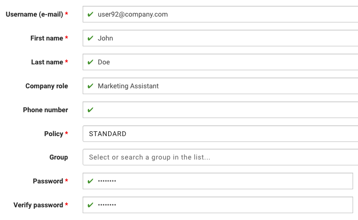

# Adding users or synchronizing them with LDAP server

1. Click **Users** located in left menu, this will move you to KODO users page

## LDAP USERS:

1. Click **LDAP SYNC** button. User will be synchronized with KODO according to LDAP server configuration in your KODO settings. If no user is synchronized, check your LDAP server and KODO configuration.

## LOCAL USERS:

1. Click **ADD LOCAL USER** button
2. Provide all necessary information to create new KODO user
   * **Username \(e-mail\)** - e-mail address used to log in to KODO client
   * **First name**
   * **Last name**
   * **Comapny role** \(optional\)
   * **Phone number** \(optional\)
   * **Policy** - default data protection policy for user
   * **Group** \(optional\)
   * **Password** - password used by user to log in to KODO client
   * **Verify password** - password used by user to log in to KODO client

     
3. Click **SAVE CHANGES** button.

