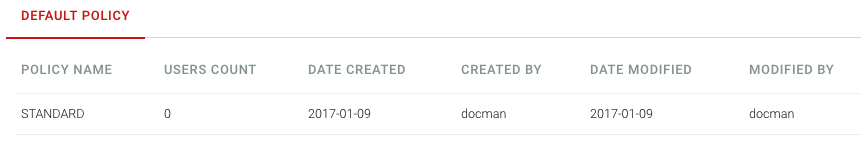
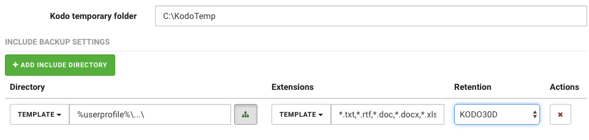

# Adjusting the default policy

Policy is a set of rules that describe how and what should be protected from the devices. There is always one default policy installed with KODO system.

To adjust the defaul policy:

1. Click **Policy** located in left menu, this will move you to KODO policy page

   

2. Click on default **STANDARD** policy name to see details
3. Click on **Edit** button to open edit policy mode
4. Configure data protection for individual systems according to KODO system documentation.

   

5. Click **SAVE CHANGES** button.

