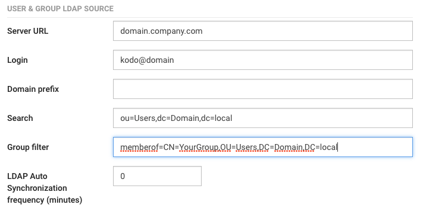
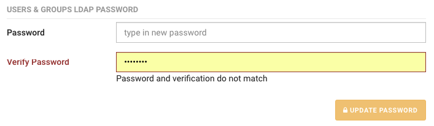

# Synchronizing users with LDAP server

KODO allows to synchronize your users with LDAP \(e.g. Active Directory\), users then will be using their LDAP login and password to log in to KODO client.

To synchronize users with LDAP server complete the following steps:

1. Click **Settings** located in top bar, this will move you to KODO configuration page
2. Click **LDAP** tab.
3. Provide information about your LDAP server:
   * **Server URL** - the IP address or DNS name of domain server
   * **Login** - Username used to log in to domain server
   * **Domain prefix** - domain prefix if different than default
   * **Search** and **Group filter** - select the entries to be returned for a search operation.

     
4. Click **SAVE CHANGES** button.
5. Provide password for LDAP server in **USERS & GROUPS LDAP PASSWORD** section

   

6. click “UPDATE PASSWORD” button

